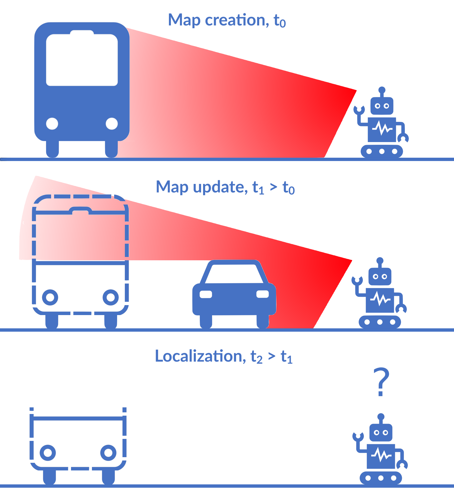

# Object-Oriented Grid Mapping in Dynamic Environments



**Authors:** [Matti Pekkanen](https://research.aalto.fi/en/persons/matti-pekkanen) (<matti.pekkanen@aalto.fi>), [Francesco
Verdoja](https://research.aalto.fi/en/persons/francesco-verdoja), and [Ville
Kyrki](https://research.aalto.fi/en/persons/ville-kyrki)\
**Affiliation:** School of Electrical Engineering, Aalto University, Finland

Grid maps, especially occupancy grid maps, are ubiquitous in many mobile robot applications. To simplify the process of learning the map, grid maps subdivide the world into a grid of cells whose occupancies are independently estimated using measurements in the perceptual field of the particular cell. However, the world consists of objects that span multiple cells, which means that measurements falling onto a cell provide evidence of the occupancy of other cells belonging to the same object. Current models do not capture this correlation and, therefore, do not use object-level information for estimating the state of the environment.
In this work, we present a way to generalize the update of grid maps, relaxing the assumption of independence. We propose modeling the relationship between the measurements and the occupancy of each cell as a set of latent variables and jointly estimate those variables and the posterior of the map.
We propose a method to estimate the latent variables by clustering based on semantic labels and an extension to the Normal Distributions Transform Occupancy Map (NDT-OM) to facilitate the proposed map update method. We perform comprehensive map creation and localization experiments with real-world data sets and show that the proposed method creates better maps in highly dynamic environments compared to state-of-the-art methods. Finally, we demonstrate the ability of the proposed method to remove occluded objects from the map in a lifelong map update scenario.

## Installation

Docker compose file provided in folder `docker`
```bash
docker compose up -d --build && docker attach lamide
cd <to catkin ws>
catkin build
```

Velodyne driver version 1.3.0 is required to be build in the catkin workspace.

## Replicating the experiments

```bash
cd launch/scripts/docker/
./run-all-cluster-loc-experiments-cluster.sh
./run-all-cluster-loc-experiments-om.sh
./run-all-cluster-map-experiments.sh
```

## Citation

If you find this work useful, please consider citing:

```bibtex
@misc{pekkanen_2024_object_oriented_mapping,
  title = {Object-Oriented Grid Mapping in Dynamic Environments},
  author = {Pekkanen, Matti and Verdoja, Francesco and Kyrki, Ville},
  publisher = {arXiv},
  year = {2024},
  url = {https://arxiv.org/abs/2309.08324},
  doi = {10.48550/ARXIV.2309.08324},
  copyright = {Creative Commons Attribution Non Commercial No Derivatives 4.0 International}
}
```

## Original work

This work builds upon the following software:
- [Graph map](https://gitsvn-nt.oru.se/software/graph\_map\_public.git) by Daniel Adolfsson, and Henrik Andreasson
- [Velodyne pointcloud](https://github.com/dan11003/velodyne\_pointcloud\_oru.git) by Daniel Adolfsson
- [NDT Core](https://gitsvn-nt.oru.se/software/ndt\_core\_public.git) by Henrik Andreasson, Todor Stoyanov, Daniel Canelhas, Martin Magnusson, Jari Saarinen, Tomasz Kucner, Malcolm Mielle, Chittaranjan Swaminathan, and Daniel Adolfsson
- [NDT Tools](https://gitsvn-nt.oru.se/software/ndt\_tools\_public.git) by Henrik Andreasson, Todor Stoyanov, Daniel Canelhas, Martin Magnusson, Jari Saarinen, Tomasz Kucner, Malcolm Mielle, Chittaranjan Swaminathan, and Daniel Adolfsson

NDT repositories contain a vast number of contributions, and exhaustive list of citations is not presented here. When using the NDT software, please find the appropriate contributions, and cite appropriately.

<details>
<summary>Example list of citations</summary>

```bibtex
@article{magnusson2007scan,
  title={Scan registration for autonomous mining vehicles using 3D-NDT},
  author={Magnusson, Martin and Lilienthal, Achim and Duckett, Tom},
  journal={Journal of Field Robotics},
  volume={24},
  number={10},
  pages={803--827},
  year={2007},
  publisher={Wiley Online Library}
}

@article{stoyanov2012fast,
  title={Fast and accurate scan registration through minimization of the distance between compact 3D NDT representations},
  author={Stoyanov, Todor and Magnusson, Martin and Andreasson, Henrik and Lilienthal, Achim J},
  journal={The International Journal of Robotics Research},
  volume={31},
  number={12},
  pages={1377--1393},
  year={2012},
  publisher={Sage Publications Sage UK: London, England}
}

@inproceedings{saarinen2013normal,
  title={Normal distributions transform occupancy maps: Application to large-scale online 3D mapping},
  author={Saarinen, Jari and Andreasson, Henrik and Stoyanov, Todor and Ala-Luhtala, Juha and Lilienthal, Achim J},
  booktitle={2013 IEEE international conference on robotics and automation},
  pages={2233--2238},
  year={2013},
  organization={IEEE}
}

@inproceedings{stoyanov2013normal,
  title={Normal distributions transform occupancy map fusion: Simultaneous mapping and tracking in large scale dynamic environments},
  author={Stoyanov, Todor and Saarinen, Jari and Andreasson, Henrik and Lilienthal, Achim J},
  booktitle={2013 IEEE/RSJ International Conference on Intelligent Robots and Systems},
  pages={4702--4708},
  year={2013},
  organization={IEEE}
}

@inproceedings{saarinen2013normal,
  title={Normal distributions transform Monte-Carlo localization (NDT-MCL)},
  author={Saarinen, Jari and Andreasson, Henrik and Stoyanov, Todor and Lilienthal, Achim J},
  booktitle={2013 IEEE/RSJ international conference on intelligent robots and systems},
  pages={382--389},
  year={2013},
  organization={IEEE}
}
```

</details>

## Acknowledgements

This work was supported by Business Finland, decision 9249/31/2021. We gratefully acknowledge the support of NVIDIA Corporation with the donation of the Titan Xp GPU used for this research.
